# 实验一

### 姓名：甘雨凡 学号：201810414201 班级：18软工二班
## 实验目的：
分析SQL执行计划，执行SQL语句的优化指导。

理解分析SQL语句的执行计划的重要作用。

## 实验内容：
### 查询语句1：

set autotrace on

SELECT d.department_name,count(e.job_id)as "部门总人数",
avg(e.salary)as "平均工资"
from hr.departments d,hr.employees e
where d.department_id = e.department_id
and d.department_name in ('IT','Sales')
GROUP BY d.department_name;

### 执行结果：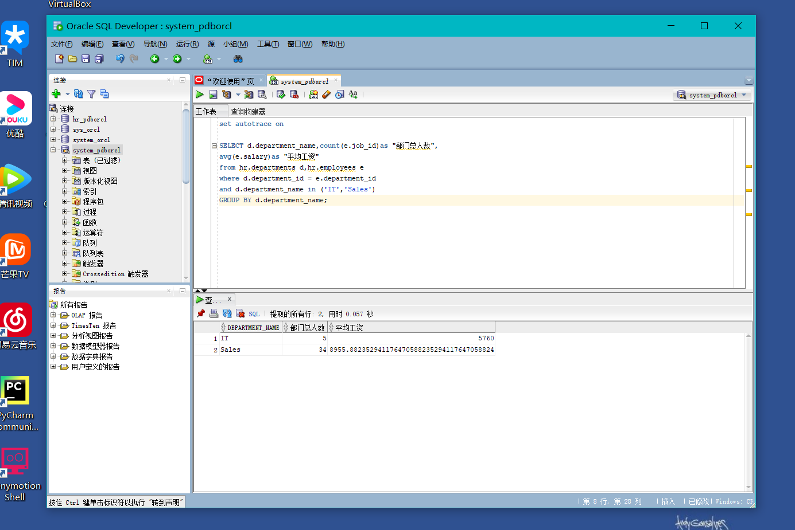
### 执行计划：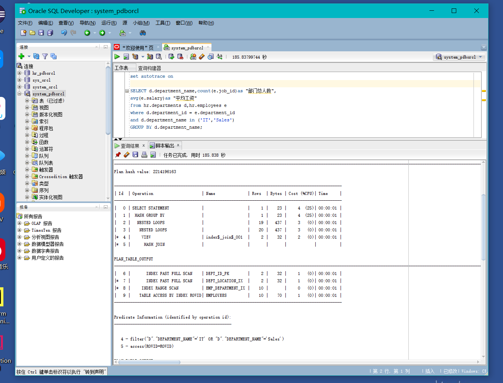 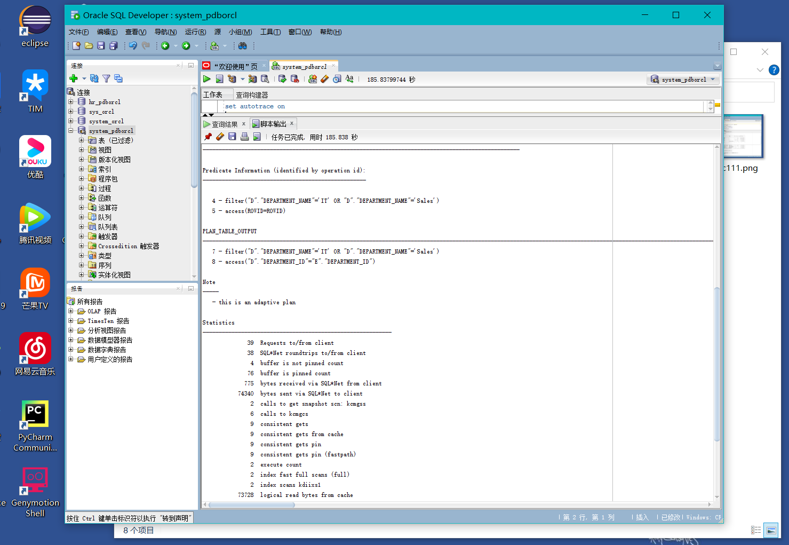 
### 优化指导：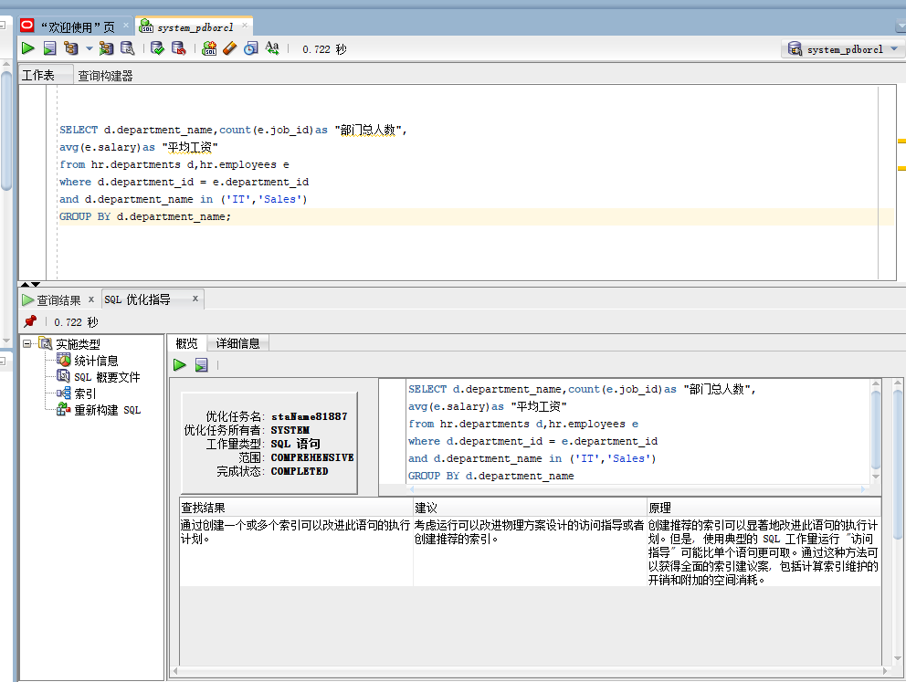
查询1执行优化指导时，工具建议考虑运行可以改进的物理设计方案，或者创建推荐的索引
### 查询语句2：

set autotrace on

SELECT d.department_name,count(e.job_id)as "部门总人数",
avg(e.salary)as "平均工资"
FROM hr.departments d,hr.employees e
WHERE d.department_id = e.department_id
GROUP BY d.department_name
HAVING d.department_name in ('IT','Sales');

### 执行结果：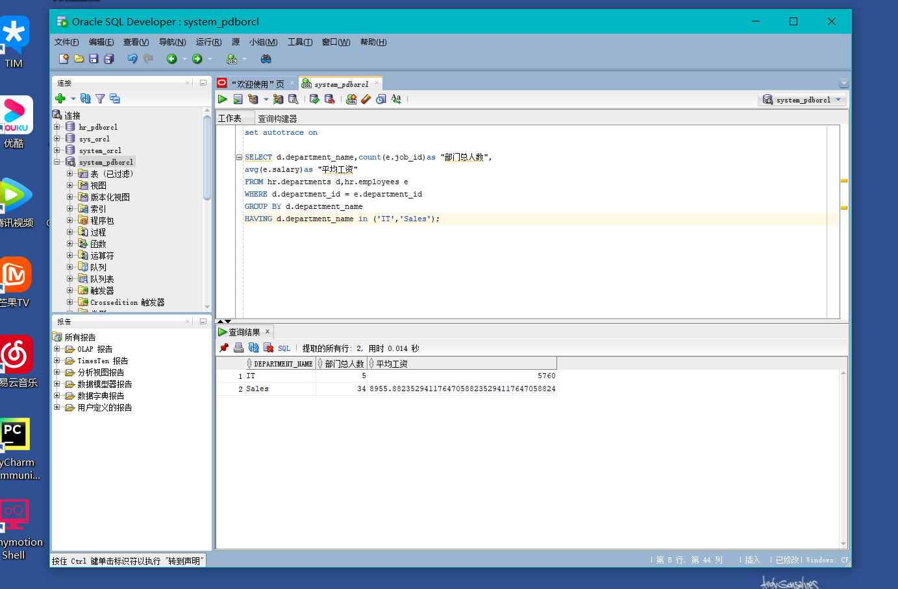
### 执行计划：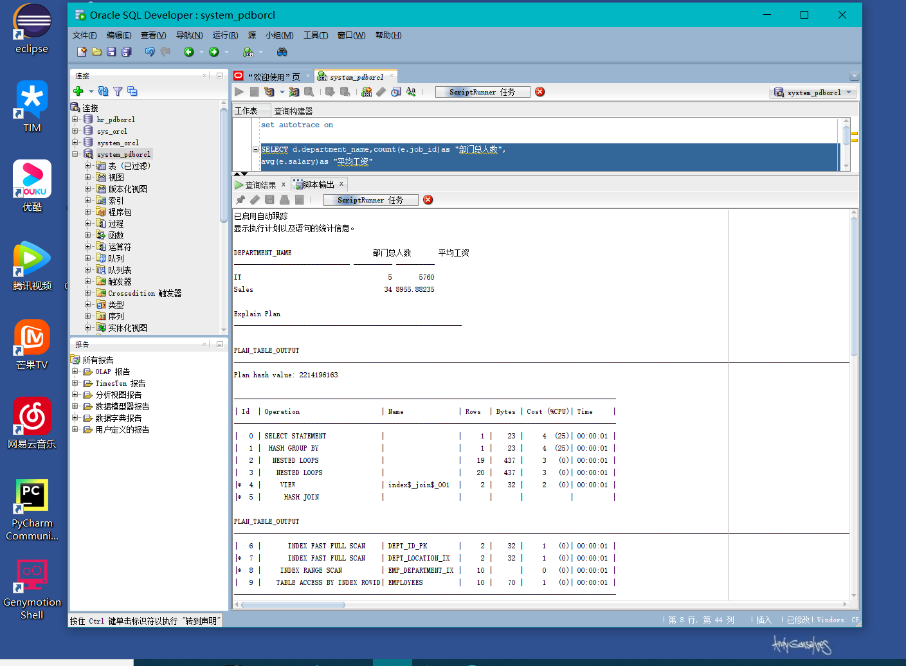 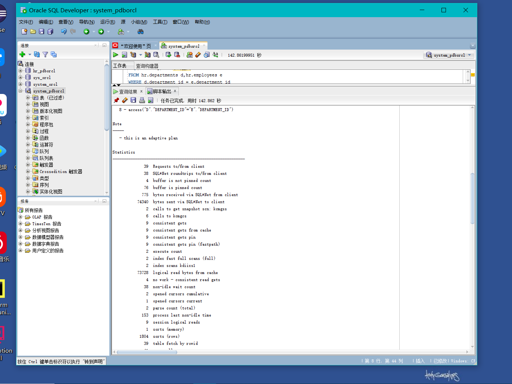
### 优化指导：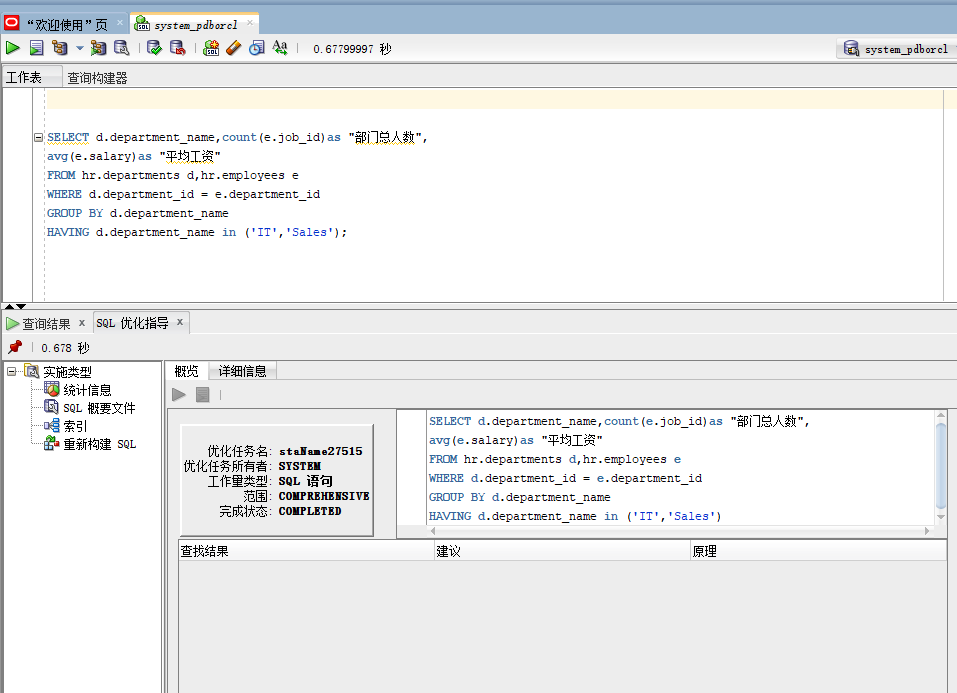
查询2执行优化指导时，工具没有给出优化建议。

### 查询语句3：

SELECT
   d.department_name,count(e.job_id)as "部门总人数",avg(e.salary)as "平均工资"
FROM  hr.departments d,hr.employees e
WHERE e.department_id=d.department_id and (d.department_id=60 or  d.department_id=80) group by d.department_name

### 执行结果：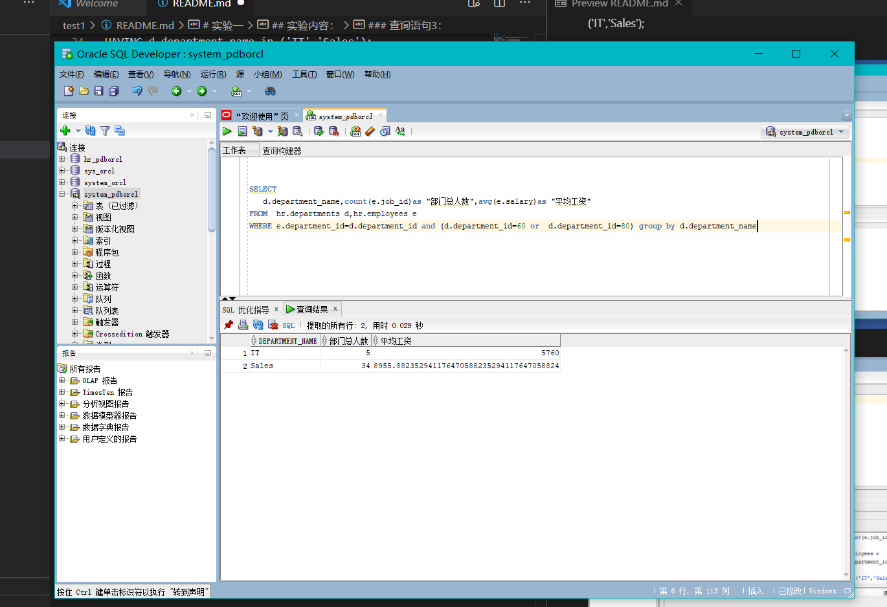
### 执行计划：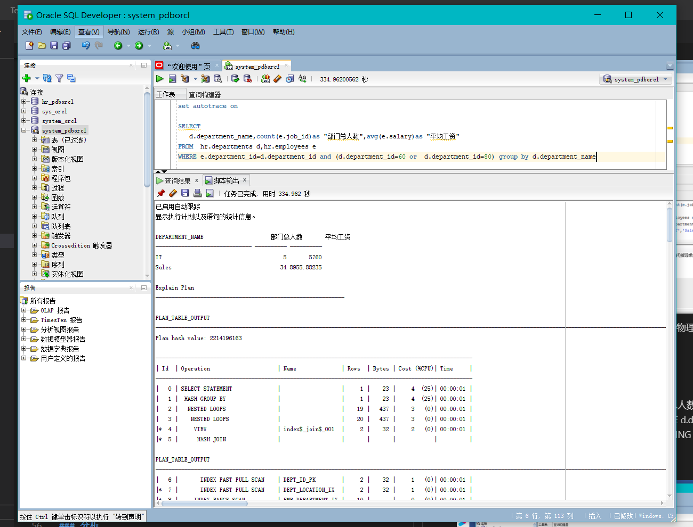 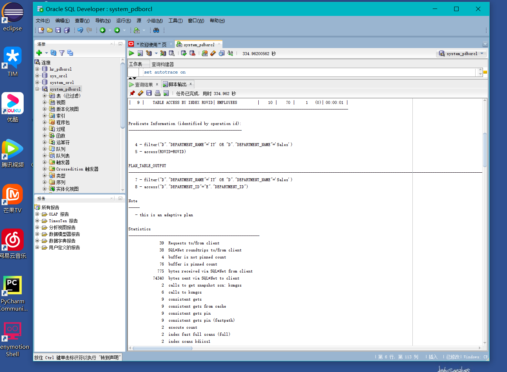
### 优化指导：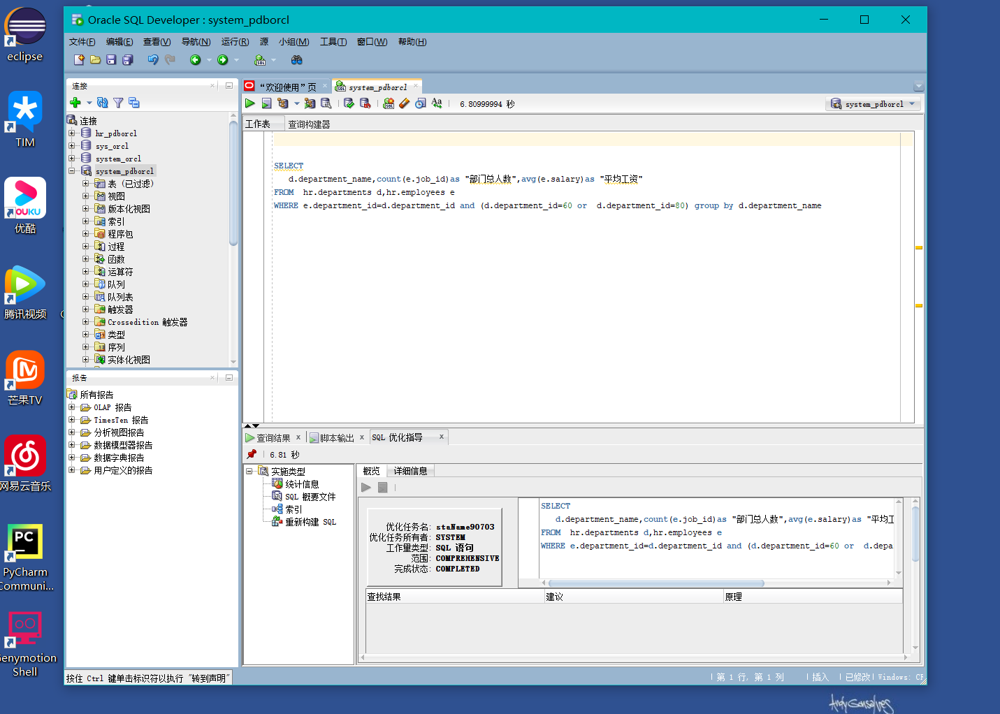
查询3执行优化指导时，工具没有给出优化建议。

### 分析
执行上面两个比较复杂的返回相同查询结果数据集的SQL语句，查询1用时0.057s；查询2用时0.014s。查询3用时0.029s。通过分析SQL语句各自的执行计划，得出查询1的总代价2小于查询2的总代价5，综合来看查询1优于查询2优于查询3。执行优化指导时，工具没有给出优化建议。
 