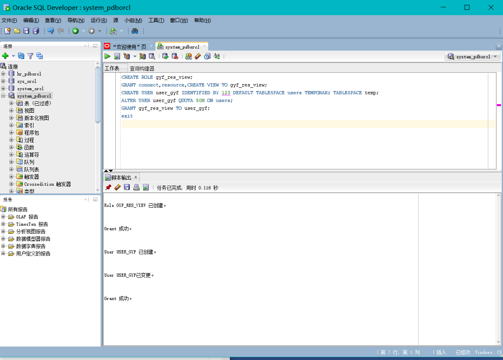
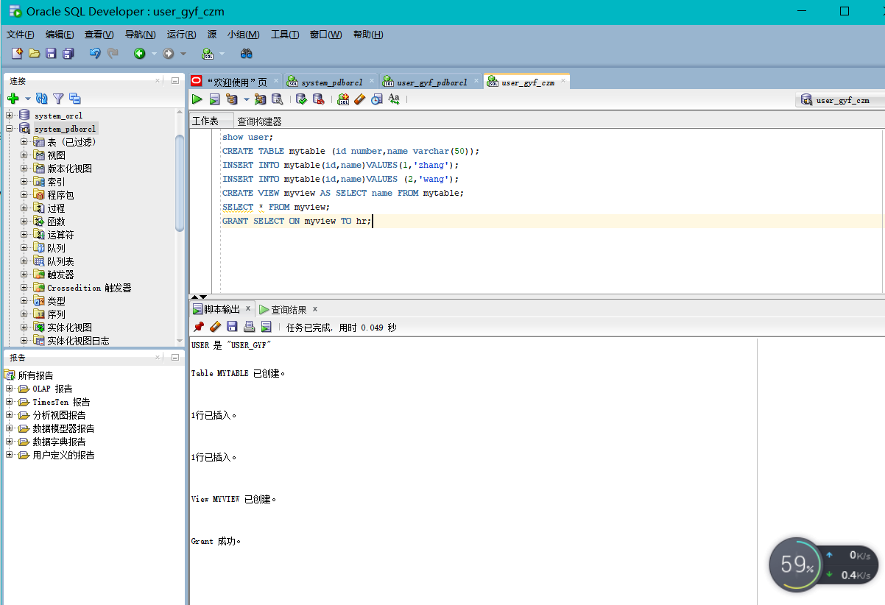
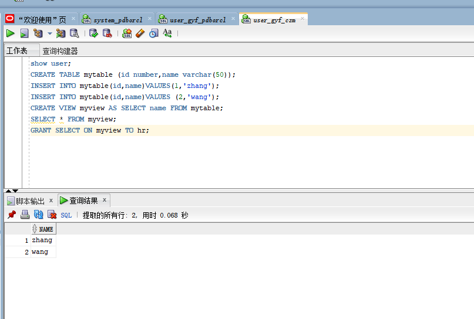
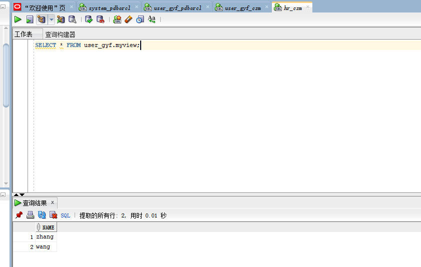
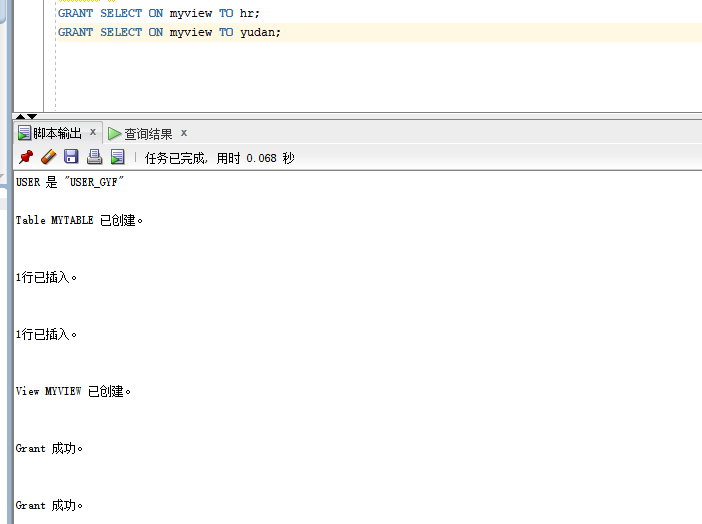
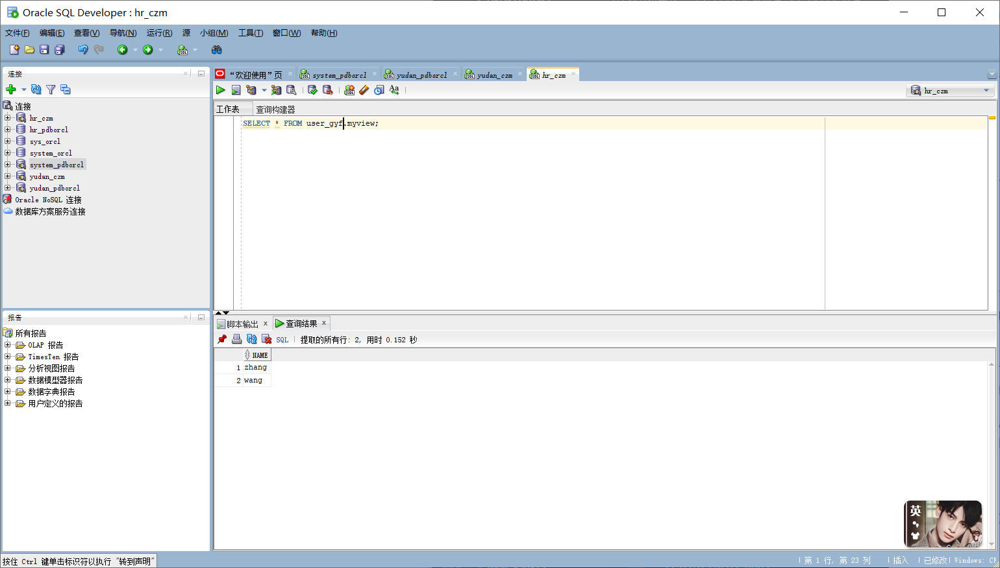
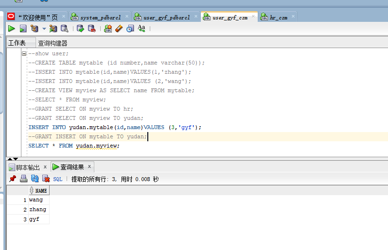
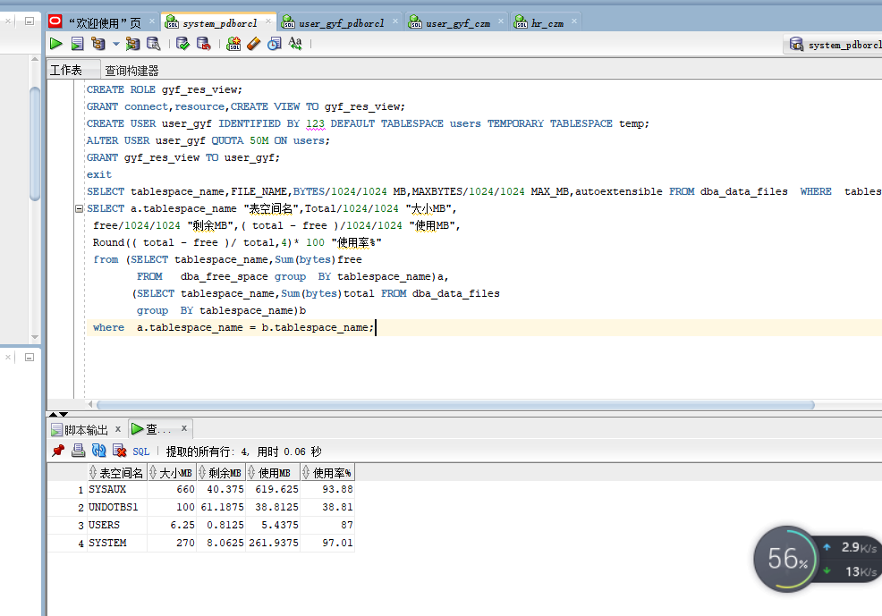

# 实验二

### 姓名：甘雨凡   学号：201810414201
### 班级：18软工二班    用户名：user_gyf
## 实验目的：
掌握用户管理、角色管理、权根维护与分配的能力;

掌握用户之间共享对象的操作技能;

## 实验内容：
### Oracle有一个开发者角色resource，可以创建表、过程、触发器等对象，但是不能创建视图。本训练要求：

在pdborcl插接式数据中创建一个新的本地角色con_res_view，该角色包含connect和resource角色，同时也包含CREATE VIEW权限，这样任何拥有con_res_view的用户就同时拥有这三种权限。

创建角色之后，再创建用户new_user，给用户分配表空间，设置限额为50M，授予con_res_view角色。

最后测试：用新用户new_user连接数据库、创建表，插入数据，创建视图，查询表和视图的数据。

## 实验步骤：
第1步：以system登录到pdborcl，创建角色gyf_res_view和用户 user_gyf，并授权和分配空间：
### 实验代码
CREATE ROLE gyf_res_view;
GRANT connect,resource,CREATE VIEW TO gyf_res_view;
CREATE USER user_gyf IDENTIFIED BY 123 DEFAULT TABLESPACE users TEMPORARY TABLESPACE temp;
ALTER USER user_gyf QUOTA 50M ON users;
GRANT gyf_res_view TO user_gyf;

### 实验截图：

第2步：新用户user_gyf连接到pdborcl，创建表mytable和视图myview，插入数据，最后将myview的SELECT对象权限授予hr用户。
### 实验代码
show user;
CREATE TABLE mytable (id number,name varchar(50));
INSERT INTO mytable(id,name)VALUES(1,'zhang');
INSERT INTO mytable(id,name)VALUES (2,'wang');
CREATE VIEW myview AS SELECT name FROM mytable;
SELECT * FROM myview;
### 实验截图：
### 实验截图：

第3步：用户hr连接到pdborcl，查询new_user授予它的视图myview
### 实验代码
GRANT SELECT ON myview TO hr;
### 实验截图：

## 测试一下同学用户之间的表的共享，只读共享和读写共享都测试一下。
### 实验代码
GRANT SELECT ON myview TO yudan;
INSERT INTO yudan.mytable(id,name)VALUES (3,'gyf');
GRANT INSERT ON mytable TO yudan;
SELECT * FROM yudan.myview;
### 测试只读共享
### 授权实验截图：
### 查询结果实验截图：
### 测试读写共享
同学授权之后写入的结果
###  实验截图

## 数据库和表空间占用分析
数据库pdborcl中包含了每个同学的角色和用户。 所有同学的用户都使用表空间users存储表的数据。 表空间中存储了很多相同名称的表mytable和视图myview，但分别属性于不同的用户，不会引起混淆。 随着用户往表中插入数据，表空间的磁盘使用量会增加。
## 查看数据库的使用情况
以下样例查看表空间的数据库文件，以及每个文件的磁盘占用情况。
### 实验代码
SELECT tablespace_name,FILE_NAME,BYTES/1024/1024 MB,MAXBYTES/1024/1024 MAX_MB,autoextensible FROM dba_data_files  WHERE  tablespace_name='USERS';
SELECT a.tablespace_name "表空间名",Total/1024/1024 "大小MB",
 free/1024/1024 "剩余MB",( total - free )/1024/1024 "使用MB",
 Round(( total - free )/ total,4)* 100 "使用率%"
 from (SELECT tablespace_name,Sum(bytes)free
        FROM   dba_free_space group  BY tablespace_name)a,
       (SELECT tablespace_name,Sum(bytes)total FROM dba_data_files
        group  BY tablespace_name)b
 where  a.tablespace_name = b.tablespace_name;
###  实验截图
## 实验分析与总结：
通过完成实验掌握用户管理、角色管理、权根维护与分配的能力;以及掌握用户之间共享对象的操作技能，能够在同学用户之间的实现表的共享，包括只读共享和读写共享。
