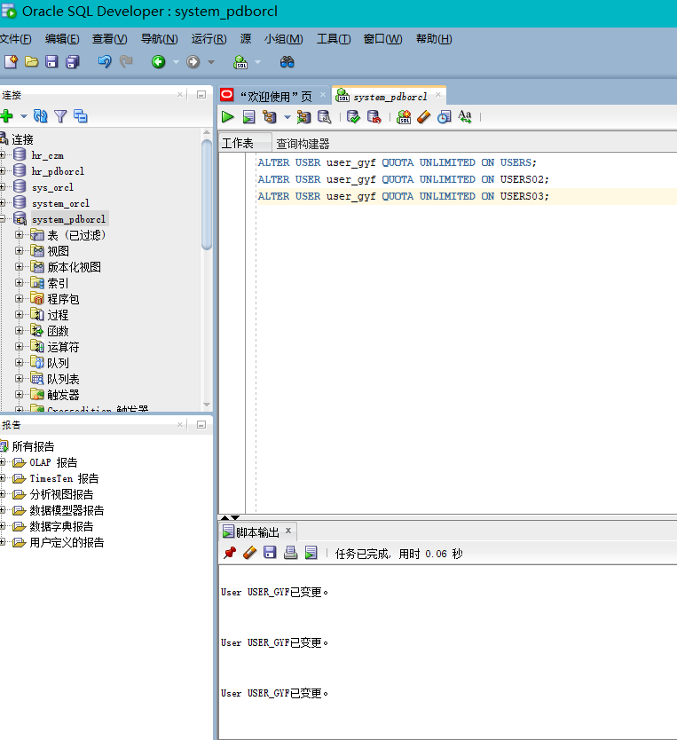

# 实验三

### 姓名：甘雨凡   学号：201810414201
### 班级：18软工二班    用户名：user_gyf
## 实验目的：
掌握分区表的创建方法，

掌握各种分区方式的使用场景。

## 实验内容：
### 本实验使用3个表空间：USERS,USERS02,USERS03。在表空间中创建两张表：订单表(orders)与订单详表(order_details)。
### 使用你自己的账号创建本实验的表，表创建在上述3个分区，自定义分区策略。
### 你需要使用system用户给你自己的账号分配上述分区的使用权限。你需要使用system用户给你的用户分配可以查询执行计划的权限。
### 表创建成功后，插入数据，数据能并平均分布到各个分区。每个表的数据都应该大于1万行，对表进行联合查询。
### 写出插入数据的语句和查询数据的语句，并分析语句的执行计划。
### 进行分区与不分区的对比实验。

### 实验步骤
1.首先创建自己的账号your_user，然后以system身份登录:
ALTER USER user_gyf QUOTA UNLIMITED ON USERS;
ALTER USER user_gyf QUOTA UNLIMITED ON USERS02;
ALTER USER user_gyf QUOTA UNLIMITED ON USERS03;
exit
### 实验截图：
2.运行实验3脚本文件
### 实验截图：
3.显示执行计划
### 实验截图：
4.查看数据库的使用情况
以下样例查看表空间的数据库文件，以及每个文件的磁盘占用情况。
### 实验代码
SELECT tablespace_name,FILE_NAME,BYTES/1024/1024 MB,MAXBYTES/1024/1024 MAX_MB,autoextensible FROM dba_data_files  WHERE  tablespace_name='USERS';

SELECT a.tablespace_name "表空间名",Total/1024/1024 "大小MB",
 free/1024/1024 "剩余MB",( total - free )/1024/1024 "使用MB",
 Round(( total - free )/ total,4)* 100 "使用率%"
 from (SELECT tablespace_name,Sum(bytes)free
        FROM   dba_free_space group  BY tablespace_name)a,
       (SELECT tablespace_name,Sum(bytes)total FROM dba_data_files
        group  BY tablespace_name)b
 where  a.tablespace_name = b.tablespace_name;
 ### 实验截图：
 ### 实验分析
执行查询语句1，可以看到order表中有10000行数据
select count(*) from orders;
### 实验截图：
执行查询语句2，可以看到 order_details表中有30000行数据
select count(*) from  order_details;
### 实验截图：
执行查询语句3，可以看到 订单表中2017-2018年6.1的数据
select * from orders where order_date
between to_date('2017-1-1','yyyy-mm-dd') and to_date('2018-6-1','yyyy-mm-dd'); 
### 实验截图：
执行查询语句4，可以看到 详情表中2017-2018年6.1的数据
select a.ORDER_ID,a.CUSTOMER_NAME,
b.product_name,b.product_num,b.product_price
from user_gyf.orders a,user_gyf.order_details b where
a.ORDER_ID=b.order_id and
a.order_date between to_date('2017-1-1','yyyy-mm-dd') and to_date('2018-6-1','yyyy-mm-dd');
### 实验截图：
 ### 实验总结
 通过完成本次实验，我学会了分区表的创建，查询等基本操作。掌握了各种分区方式的使用场景。在完成实验的过程中，遇到了一些困难，在同学的帮助下，完成了实验。