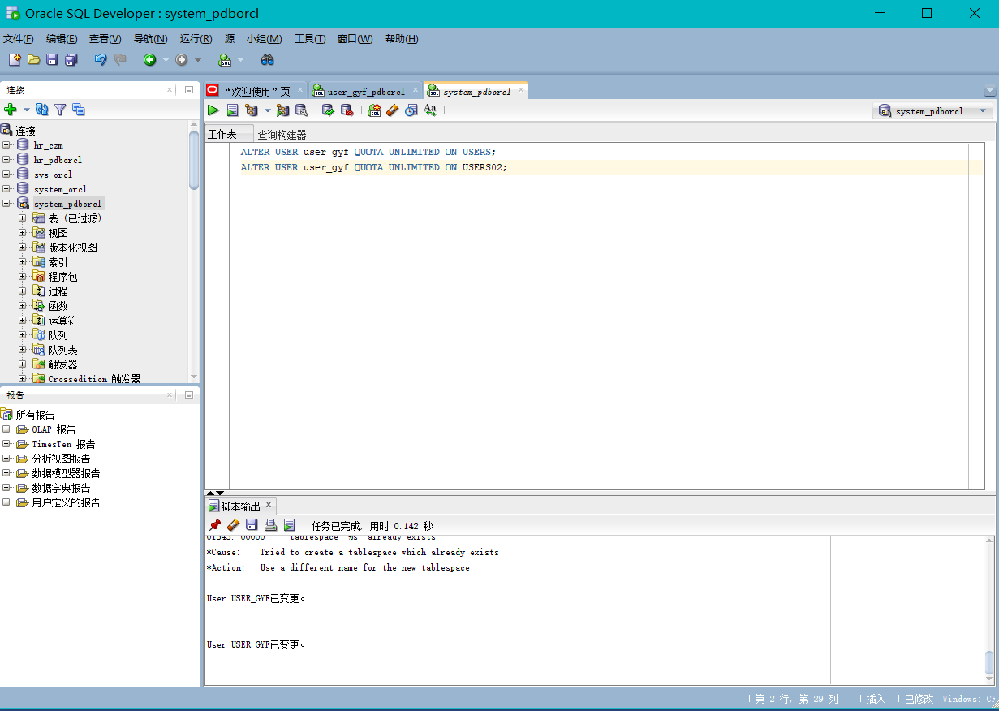
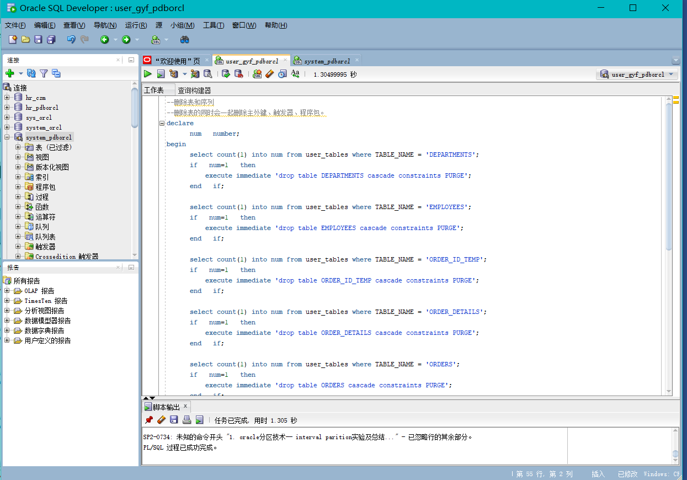
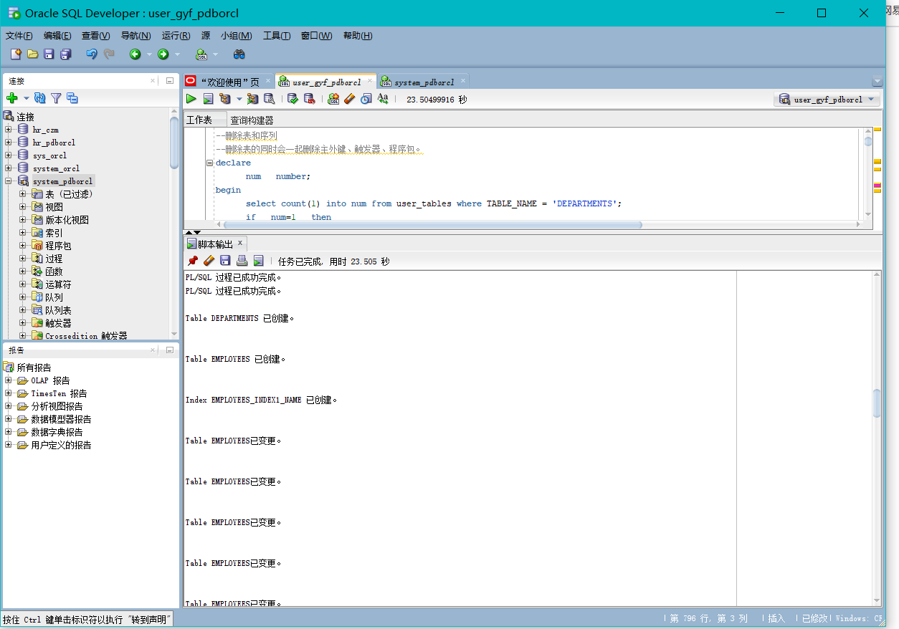
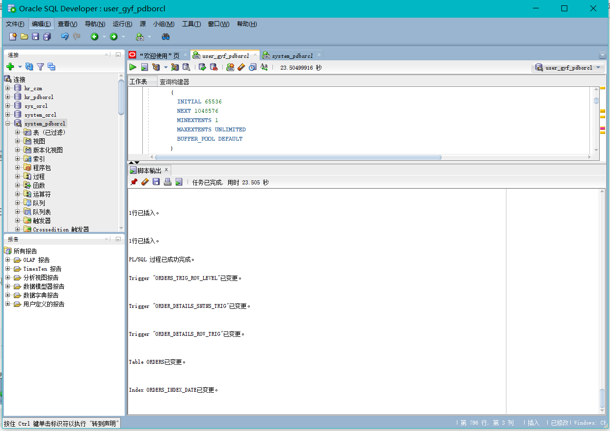
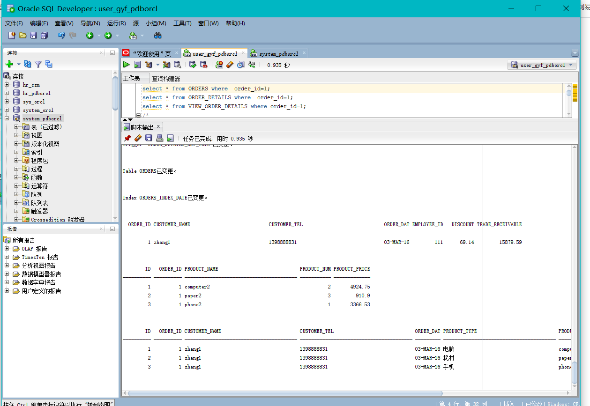
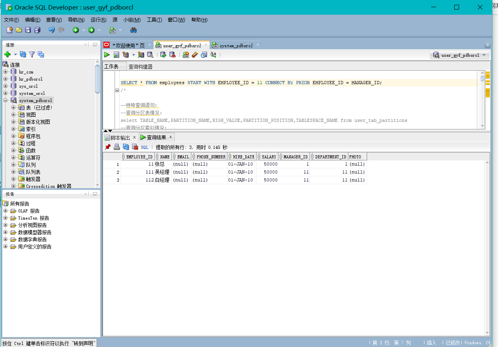
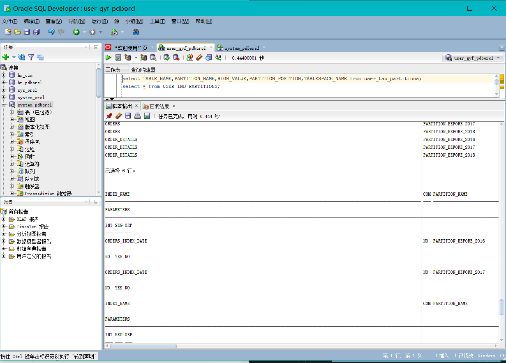
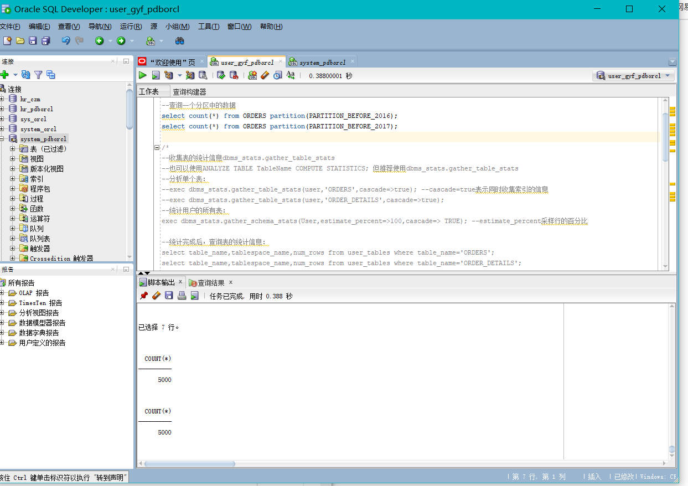
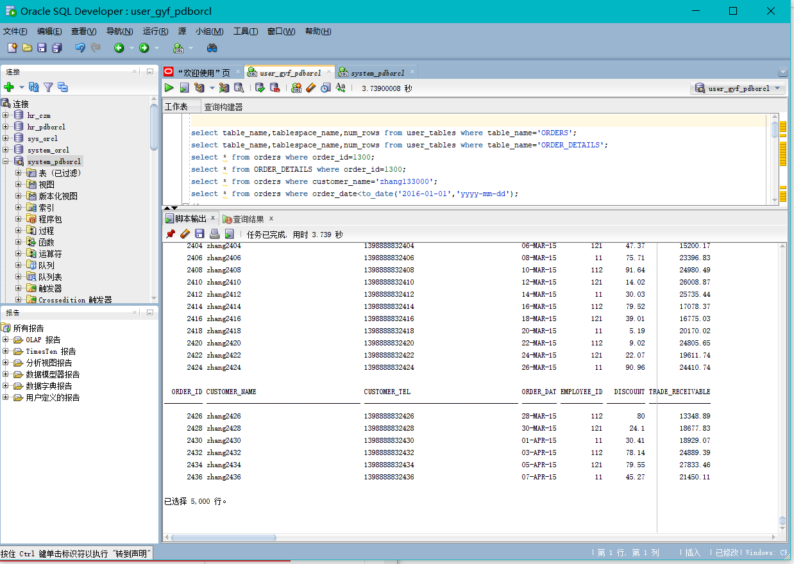
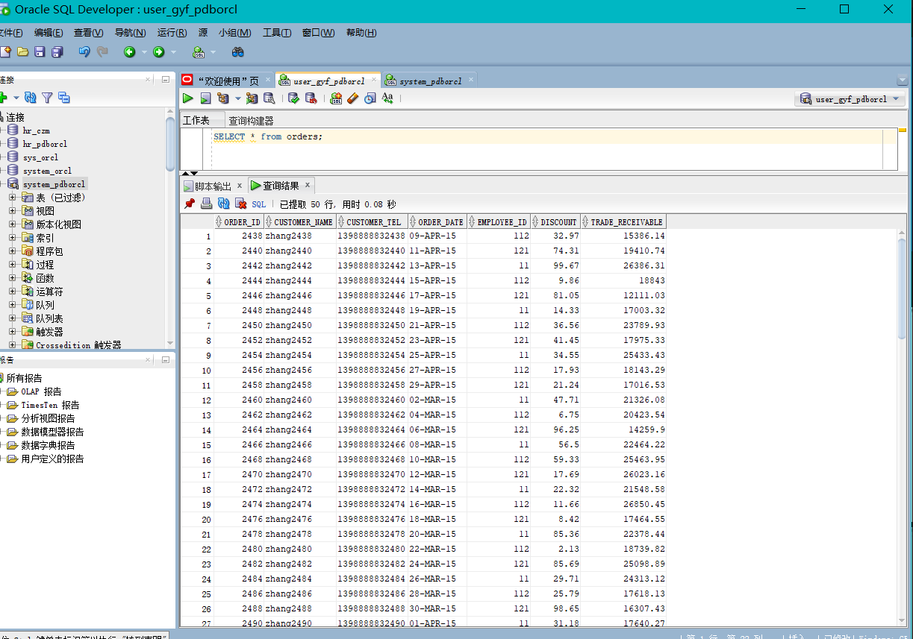

# 实验四

### 姓名：甘雨凡   学号：201810414201
### 班级：18软工二班    用户名：user_gyf
## 实验目的：
了解Oracle表和视图的概念

学习使用SQL语句Create Table创建表

学习Select语句插入，修改，删除以及查询数据

学习使用SQL语句创建视图，学习部分存储过程和触发器的使用
### 实验场景：
假设有一个生产某个产品的单位，单位接受网上订单进行产品的销售。通过实验模拟这个单位的部分信息：员工表，部门表，订单表，订单详单表。
### 实验内容：

### 给用户 user_gyf 授予表空间 Users 的使用权限

### 给用户 user_gyf 授予表空间 Users02 的使用权限
#### 实验截图：

### 删除表和序列:
#### 实验截图：
### 录入数据，运行SQL文件:
#### 实验截图： 
### 测试：
1.一切就绪，开始测试：
以下时间在0.02秒以内才正常：（id取值从1到20000000）
#### 实验截图：
2.递归查询某个员工及其所有下属，子下属员工。
#### 实验截图：
3.查询分区表情况:
select TABLE_NAME,PARTITION_NAME,HIGH_VALUE,PARTITION_POSITION,TABLESPACE_NAME from user_tab_partitions

查询分区索引情况：
select * from USER_IND_PARTITIONS;
#### 实验截图：
4.查询一个分区中的数据
#### 实验截图：
5.统计完成后，查询表的统计信息：
#### 实验截图：
6.查询订单表：
#### 实验截图：
### 实验总结：
通过完成本次实验，我收获了很多。我了解Oracle表和视图的概念，学会了使用SQL语句Create Table创建表以及Select语句插入，修改，删除以及查询数据，还有使用SQL语句创建视图，学习部分存储过程和触发器的使用。